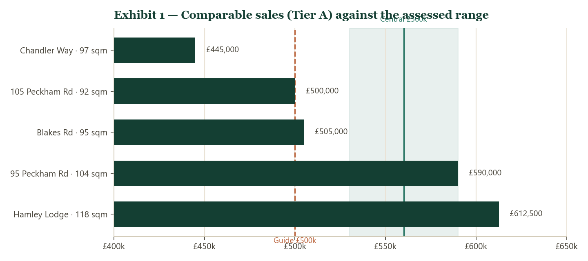
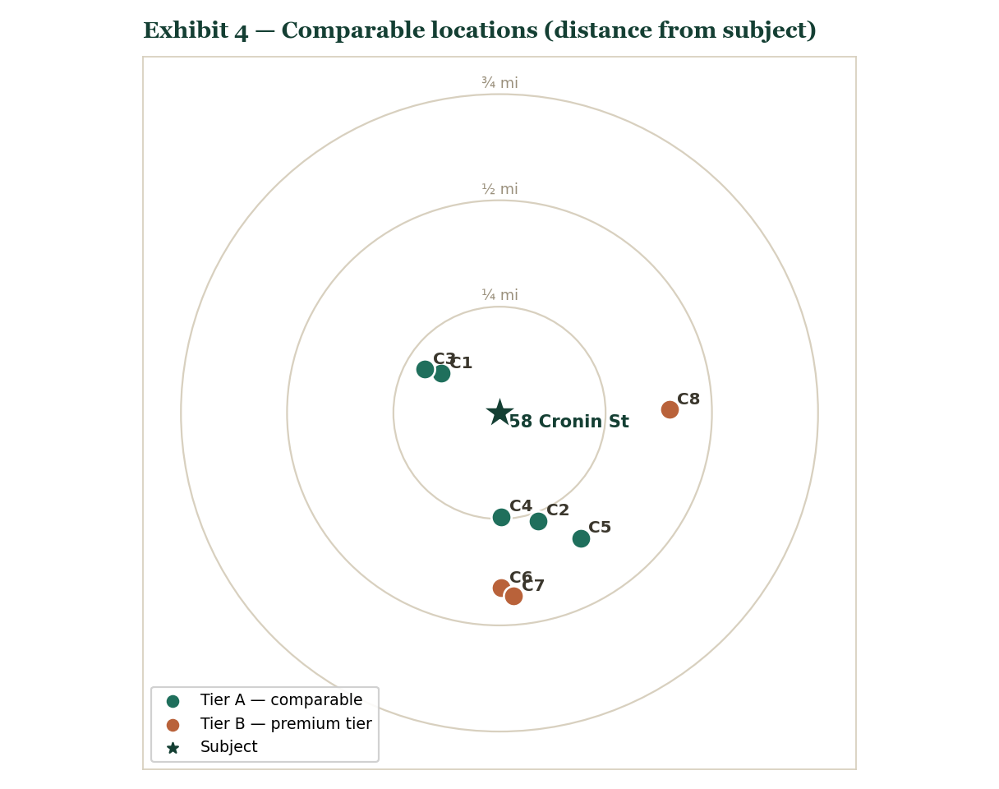
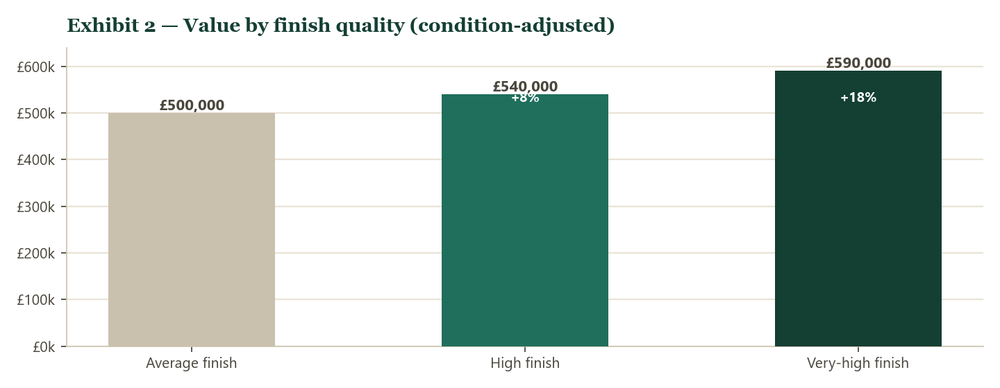
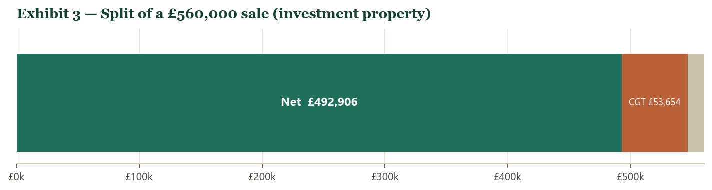

# Market Appraisal — 58 Cronin Street, Peckham, London SE15 6JH

**Prepared by Riccardo Minniti** · 5 June 2026
Interactive version: [cronin_street_interactive.html](file:///C:/Users/Hello/propertydata/cronin_street_interactive.html)

---

## Contents

1. [Executive summary](#executive-summary)
2. [The property](#the-property)
3. [Basis of assessment](#basis-of-assessment)
4. [Comparable evidence](#comparable-evidence)
5. [Market analysis](#market-analysis)
6. [Valuation](#valuation)
7. [Sale history](#sale-history)
8. [Market conditions](#market-conditions)
9. [Live market & competitive positioning](#live-market-competitive-positioning)
10. [Recommended guide price](#recommended-guide-price)
11. [Net proceeds & Capital Gains Tax](#net-proceeds-capital-gains-tax)
12. [Limitations](#limitations)
13. [Sources & references](#sources-references)

---

## Executive summary

A four-bedroom, two-bathroom ex-local-authority maisonette of approximately 103 sqm, refurbished to a high standard. Comparable same-size, same-character flats within 0.5 miles transact at £445,000–£612,500 in average condition. The refurbishment places this property at the upper end of, and above, that range.

| | |
|---|---|
| **Assessed value range (as refurbished)** | **£530,000 – £590,000** (central ~£560,000) |
| **Recommended guide price** | **Offers Over £500,000** |
| **Target sale band** | £545,000 – £575,000 |
| **Last recorded sale** | £320,000 (6 February 2015) |
| **Tenure** | Leasehold; ~102 years unexpired |
| **Held as** | Investment property — Capital Gains Tax applies |

---

## The property

A second-floor maisonette of ex-local-authority construction (1976–1982), recorded at 1,109 sqft (103 sqm), EPC rating C (69). Marketed as four bedrooms and two bathrooms, refurbished to a high standard. Leasehold on a 125-year term from September 2003 (~102 years unexpired; no short-lease adjustment), Council Tax Band B. One sale is recorded: £320,000 on 6 February 2015. The refurbishment is addressed at [Valuation](#valuation).

---

## Basis of assessment

A comparable is a sale matching the subject on property type, floor area, location, building character, recency and arm's-length status. Bedroom count alone is not used; flats sharing a bedroom count vary widely in size, character and value.

Evidence is drawn from flats of 88–118 sqm (the subject is 103 sqm), within 0.5 miles, sold within 24 months to 5 June 2026, sourced from HM Land Registry Price Paid Data, and grouped by building character. The refurbishment is measured with a condition-adjusted valuation for the subject. Price per square metre is shown for reference and is not the primary basis.

---

## Comparable evidence

All sales are HM Land Registry Price Paid records, held live on [PropertyData](https://propertydata.co.uk/r/rLY3b9Bo). Each linked transaction below opens the free record for that exact sale — the property, its photographs and full sale detail. Floor areas are from the EPC Register and are indicative.

### Tier A — comparable character (ex-local-authority / estate / Peckham Road)

| Ref. | Comparable (type · size) | Sold | Price | £/sqm | Dist. | Source |
|---|---|---|---|---|---|---|
| C1 | Flat 8, 86 Chandler Way, SE15 6GT · 2-bed flat · 97 sqm | Jan 2026 | £445,000 | £4,588 | 0.17 mi | [PropertyData](https://propertydata.co.uk/transaction/4C1B673F-A885-D8EA-E063-4704A8C0BF7D) |
| C2 | Flat 8, 105 Peckham Road, SE15 5LE · flat · 92 sqm | Mar 2026 | £500,000 | £5,435 | 0.27 mi | [PropertyData](https://propertydata.co.uk/transaction/50D10B84-743A-B8D0-E063-4704A8C08D98) |
| C3 | Flat 6, 73 Blakes Road, SE15 6HB · flat · 95 sqm | Jun 2024 | £505,000 | £5,316 | 0.20 mi | [PropertyData](https://propertydata.co.uk/transaction/2859C1AC-8F78-52B4-E063-4804A8C05948) |
| C4 | 95 (Apt 7) Peckham Road, SE15 5FA · flat · 104 sqm | Apr 2026 | £590,000 | £5,673 | 0.25 mi | [PropertyData](https://propertydata.co.uk/transaction/50D10B84-76DA-B8D0-E063-4704A8C08D98) |
| C5 | Flat 9, Hamley Lodge, 29 Peckham High Street, SE15 5EB · flat · 118 sqm | Oct 2024 | £612,500 | £5,191 | 0.35 mi | [PropertyData](https://propertydata.co.uk/transaction/44F406B6-EDBD-1095-E063-4704A8C048D4) |

Tier A median **£505,000** (range £445,000–£612,500), average or unrecorded condition.

### Tier B — distinct market tier (premium conversions / larger units); context only

| Ref. | Comparable (type · size) | Sold | Price | £/sqm | Dist. | Source |
|---|---|---|---|---|---|---|
| C6 | Flat A, 65 Denman Road, SE15 5NS · flat · 100 sqm | Sep 2025 | £750,000 | £7,500 | 0.41 mi | [PropertyData](https://propertydata.co.uk/transaction/402A3A66-4D55-A7DF-E063-4804A8C0B80D) |
| C7 | Flat 3, 56 Denman Road, SE15 5NR · flat · 93 sqm | Mar 2026 | £765,000 | £8,226 | 0.44 mi | [PropertyData](https://propertydata.co.uk/transaction/4E75C29D-C0CD-8922-E063-4804A8C094D0) |
| C8 | 102 Leontine Close, SE15 1UJ · 4-bed flat · 114 sqm | Nov 2024 | £706,700 | £6,199 | 0.40 mi | [PropertyData](https://propertydata.co.uk/transaction/2ACACE8D-4ACB-295E-E063-4804A8C0B0EB) |

Period conversions on a higher-value street and a larger unit (£6,199–£8,226/sqm). Matched on size and distance but a separate tier; excluded from the valuation, retained to mark the local ceiling.

---

## Market analysis

Regression and trend analysis of SE15 flat sales (n = 663, 24 months, HM Land Registry):

- **What drives price.** Floor area and time together explain about **33%** of sold price; the remaining two-thirds is location, character and condition. This is the evidence for selecting comparables on character and adjusting for the refurbishment, rather than relying on £/sqm or bedroom count. The marginal value of floor area is **£4,699/sqm** — below the median £/sqm, so larger flats carry a lower rate.
- **Direction of the market.** Controlling for size, prices are easing about **−2.8% per year** (median £/sqm −2.0% between the first and second halves of the period). This is consistent with reported SE15 sector movement of −1.9% to −2.6% over the year [housemetric].
- **Location tiers (median £/sqm).** SE15 4 £8,500 · SE15 3 £7,180 · SE15 2 £6,802 · SE15 5 £6,647 · **SE15 6 (subject) £6,188** · SE15 1 £5,104. The subject is in the value end of the district — the basis for excluding higher-tier sectors from the comparable set.

A softening market in which location and condition dominate supports a conservative, below-range guide.

---

## Valuation

Tier A places a flat of the subject's size and character, in average condition, at £505,000–£530,000. A condition-adjusted valuation for the subject, holding size, location and configuration constant, isolates finish quality:

| Basis | Value |
|---|---|
| Tier A comparable median (average condition, ~103 sqm) | £505,000–£530,000 |
| Condition-adjusted valuation — average finish | £500,000 |
| Condition-adjusted valuation — high finish | £540,000 |
| Condition-adjusted valuation — very-high finish | £590,000 |
| Price-per-sqm cross-check (£5,435 × 103 sqm) | £560,000 |

The refurbishment premium is 8–18%. Comparable evidence and the condition-adjusted valuation give an assessed range of **£530,000–£590,000, central ~£560,000.** Confidence is moderate; see [Limitations](#limitations).

---

## Sale history

HM Land Registry records one sale: £320,000 on 6 February 2015, with the current 125-year lease granted at that date. No later sale is recorded.

---

## Market conditions

PropertyData indices for the SE15 district, 5 June 2026:

| Indicator | Value |
|---|---|
| Demand classification | Balanced market |
| Months of inventory | 11.1 |
| Mean days on market | 338 |
| For sale / sales per month | 456 / ~41 |

A market in balance with an extended selling period.

---

## Live market & competitive positioning

Sold prices establish what the property is *worth*; the live market shows what it is *competing against*. The assessed range above rests on completed sales — the only firm evidence of value. The asking prices below signal vendor expectation, not achieved value, and are **not** used in the assessment. They are set out to position the recommended guide against the homes a buyer can view today.

The table is the live competitive band: three- and four-bedroom flats currently listed across SE15 at £450,000–£775,000 — the realistic field for a refurbished maisonette of this size. Stock above £800,000 belongs to the premium-conversion tier (see Tier B); the two cheapest four-bedroom flats on the market (£325,000 and £375,000) sit at the bottom of the range. Bedroom count alone does not define a comparable (see [Basis of assessment](#basis-of-assessment)): size, condition and location set the price, which is why three-bedroom period conversions here reach £900,000 while four-bedroom ex-authority flats list at a third of that.

| Asking | Beds | Days listed | Status | Location | Listing |
|---|---|---|---|---|---|
| £775,000 | 3 | 1 | Available | Ivydale Road, SE15 3 | [Zoopla](https://www.zoopla.co.uk/for-sale/details/73349814/) |
| £765,000 | 3 | 64 | Available | Talfourd Road, SE15 5 | [Rightmove](https://www.rightmove.co.uk/properties/174041360) |
| £750,000 | 3 | 164 | Available | Sternhall Lane, SE15 4 | [Rightmove](https://www.rightmove.co.uk/properties/170557346) |
| £749,000 | 3 | 350 | Available | Bermondsey Heights, SE15 1 | [Rightmove](https://www.rightmove.co.uk/properties/163611641) |
| £719,000 | 3 | 806 | Available | 227-255 Ilderton Road, SE15 1 | [OnTheMarket](https://www.onthemarket.com/details/14542890/) |
| £712,000 | 3 | 722 | Available | 227-255 Ilderton Road, SE15 1 | [OnTheMarket](https://www.onthemarket.com/details/14540846/) |
| £700,000 | 3 | 10 | Available | Cheltenham Road, SE15 3 | [Zoopla](https://www.zoopla.co.uk/for-sale/details/73216854/) |
| £699,000 | 3 | 1 | Available | Bermondsey Heights, SE15 1 | [Zoopla](https://www.zoopla.co.uk/for-sale/details/73185499/) |
| £675,000 | 3 | 40 | Available | South City Court, SE15 6 | [Rightmove](https://www.rightmove.co.uk/properties/174931520) |
| £674,995 | 3 | 490 | Available | Nunhead Green, SE15 3 | [OnTheMarket](https://www.onthemarket.com/details/16472698/) |
| £650,000 | 3 | 113 | Available | Bellenden Road, SE15 4 | [Rightmove](https://www.rightmove.co.uk/properties/172110866) |
| £625,000 | 3 | 26 | Available | Woods Road, SE15 2 | [Zoopla](https://www.zoopla.co.uk/for-sale/details/73136323/) |
| £575,000 | 3 | 26 | Under offer | Gautrey Road, SE15 2 | [Zoopla](https://www.zoopla.co.uk/for-sale/details/70133310/) |
| £550,000 | 3 | 64 | Available | Trafalgar Avenue, SE15 6 | [Rightmove](https://www.rightmove.co.uk/properties/174005042) |
| £550,000 | 3 | 38 | Available | Lausanne Road, SE15 2 | [Rightmove](https://www.rightmove.co.uk/properties/174994025) |
| £525,000 | 3 | 43 | Available | Carlton Grove, SE15 2 | [Rightmove](https://www.rightmove.co.uk/properties/174819227) |
| £500,000 | 3 | 26 | Available | Ilderton Road, SE15 1 | [Zoopla](https://www.zoopla.co.uk/for-sale/details/72984214/) |
| £475,000 | 3 | 98 | Available | Queens Road, SE15 2 | [Rightmove](https://www.rightmove.co.uk/properties/87678816) |
| £460,000 | 3 | 71 | Available | Mona Road, SE15 2 | [Rightmove](https://www.rightmove.co.uk/properties/173641688) |
| £450,000 | 3 | 26 | Available | Queens Road, SE15 2 | [Zoopla](https://www.zoopla.co.uk/for-sale/details/73105430/) |

Median asking **£662,500**; average time on the market **158 days**. Each listing links to the live portal page — the asking price, photographs, time on the market and the marketing agent, open to verify.

**The cost of overpricing.** Seven of these twenty listings have sat unsold for 90 days or more. The longest are two units at 227–255 Ilderton Road, asking £712,000 and £719,000, listed for **722 and 806 days**; a third in the same development asks £749,000 at 350 days. Nunhead Green has been available 490 days at £674,995, Sternhall Lane 164 days at £750,000, Bellenden Road 113 days at £650,000. Keenly-priced, well-presented stock behaves differently: three listings went up within the last three weeks, and the only property under offer in the band was priced at £575,000. The pattern is consistent — in SE15 an over-ambitious asking price does not win a higher sale, it produces a longer and more expensive one.

**Where this property sits.** The recommended **Offers Over £500,000** is set at the lower end of the live band and **£162,500 below its median asking price** — deliberately. Anchored to sold evidence (Tier A £445,000–£612,500), it positions the property among the most competitively priced homes of its size and character on the market, to draw multiple viewings and competing offers toward the assessed **£545,000–£575,000** target — rather than joining the stalled listings above.

---

## Recommended guide price

**Offers Over £500,000**, below the assessed range of £530,000–£590,000. With a mean selling period of 338 days, a guide below assessed value invites competing offers and targets a sale in the **£545,000–£575,000** band.

---

## Net proceeds & Capital Gains Tax

The subject is held as an investment property; Capital Gains Tax (CGT) is chargeable on disposal. Figures apply an agency fee of 2% plus VAT (2.4%) and an indicative CGT charge.

| Achieved price | Fee (2% + VAT) | Net of fee | Indicative CGT | Net of fee & CGT |
|---|---|---|---|---|
| £530,000 | £12,720 | £517,280 | £46,627 | £470,653 |
| £560,000 | £13,440 | £546,560 | £53,654 | £492,906 |
| £590,000 | £14,160 | £575,840 | £60,682 | £515,158 |

Indicative CGT: chargeable gain (sale price − £320,000 acquisition − selling fee − £3,000 annual exempt amount, 2025/26) at the 24% higher-rate residential rate. It excludes 2015 acquisition costs and the refurbishment spend, both allowable deductions that reduce the liability. Indicative only; not tax advice — a chartered accountant should be consulted.

---

## Limitations

1. Recorded floor area (103 sqm, EPC) is compact for a four-bed/two-bath; a larger verified area raises the range. A measured survey or updated EPC is recommended.
2. The refurbishment specification has not been independently inspected; the 8–18% premium is modelled. Confirmation of "high" versus "very high" finish refines the upper bound.
3. Four-bed flats trade infrequently locally; the valuation rests on same-size, same-character flats (Tier A) with the condition-adjusted valuation.
4. Tier B (premium conversions, larger units) is excluded as a separate tier despite proximity and size.
5. Asking prices indicate vendor expectation and are not used in the assessed value.

---

## Sources & references

[1] HM Land Registry. *Price Paid Data*, England and Wales. Open Government Licence v3.0. Official search: https://www.gov.uk/search-house-prices. Accessed via the PropertyData API, 5 June 2026.

[2] [PropertyData](https://propertydata.co.uk/r/rLY3b9Bo). Sold-price, condition-adjusted valuation, and demand endpoints. api.propertydata.co.uk. Accessed 5 June 2026.

[3] Domestic Energy Performance Certificate Register. Floor area and energy rating. Accessed via PropertyData, 5 June 2026.

[4] HM Revenue & Customs. *Capital Gains Tax: rates and allowances.* https://www.gov.uk/capital-gains-tax/rates and https://www.gov.uk/capital-gains-tax/allowances. Accessed 5 June 2026.

[5] HM Land Registry. Title and transaction record, UPRN 200003400941 (58 Cronin Street, London SE15 6JH).

**Comparable transaction records** (HM Land Registry Price Paid; each link opens the free PropertyData transaction record — exact sale, property detail and photographs):

- [C1] Flat 8, 86 Chandler Way, London SE15 6GT — £445,000, 30 Jan 2026; ref. 4C1B673F-A885-D8EA-E063-4704A8C0BF7D. https://propertydata.co.uk/transaction/4C1B673F-A885-D8EA-E063-4704A8C0BF7D
- [C2] Flat 8, 105 Peckham Road, London SE15 5LE — £500,000, 17 Mar 2026; ref. 50D10B84-743A-B8D0-E063-4704A8C08D98. https://propertydata.co.uk/transaction/50D10B84-743A-B8D0-E063-4704A8C08D98
- [C3] Flat 6, 73 Blakes Road, London SE15 6HB — £505,000, 21 Jun 2024; ref. 2859C1AC-8F78-52B4-E063-4804A8C05948. https://propertydata.co.uk/transaction/2859C1AC-8F78-52B4-E063-4804A8C05948
- [C4] 95 (Apartment 7) Peckham Road, London SE15 5FA — £590,000, 17 Apr 2026; ref. 50D10B84-76DA-B8D0-E063-4704A8C08D98. https://propertydata.co.uk/transaction/50D10B84-76DA-B8D0-E063-4704A8C08D98
- [C5] Flat 9, Hamley Lodge, 29 Peckham High Street, London SE15 5EB — £612,500, 11 Oct 2024; ref. 44F406B6-EDBD-1095-E063-4704A8C048D4. https://propertydata.co.uk/transaction/44F406B6-EDBD-1095-E063-4704A8C048D4
- [C6] Flat A, 65 Denman Road, London SE15 5NS — £750,000, 5 Sep 2025; ref. 402A3A66-4D55-A7DF-E063-4804A8C0B80D. https://propertydata.co.uk/transaction/402A3A66-4D55-A7DF-E063-4804A8C0B80D
- [C7] Flat 3, 56 Denman Road, London SE15 5NR — £765,000, 18 Mar 2026; ref. 4E75C29D-C0CD-8922-E063-4804A8C094D0. https://propertydata.co.uk/transaction/4E75C29D-C0CD-8922-E063-4804A8C094D0
- [C8] 102 Leontine Close, London SE15 1UJ — £706,700, 26 Nov 2024; ref. 2ACACE8D-4ACB-295E-E063-4804A8C0B0EB. https://propertydata.co.uk/transaction/2ACACE8D-4ACB-295E-E063-4804A8C0B0EB

---

*Prepared by Riccardo Minniti, 5 June 2026. A comparative market appraisal based on HM Land Registry and [PropertyData](https://propertydata.co.uk/r/rLY3b9Bo) evidence accessed the same day; not a formal RICS Red Book valuation. CGT figures are indicative and not tax advice.*
