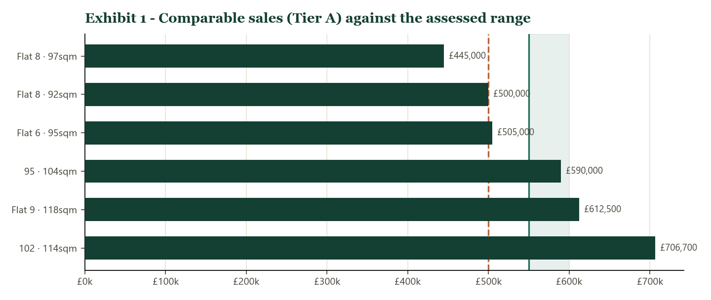
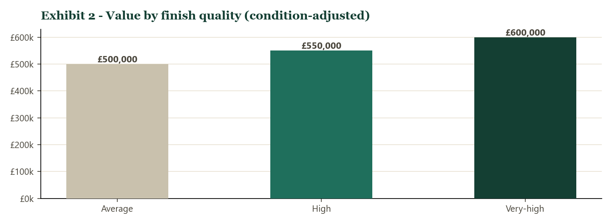
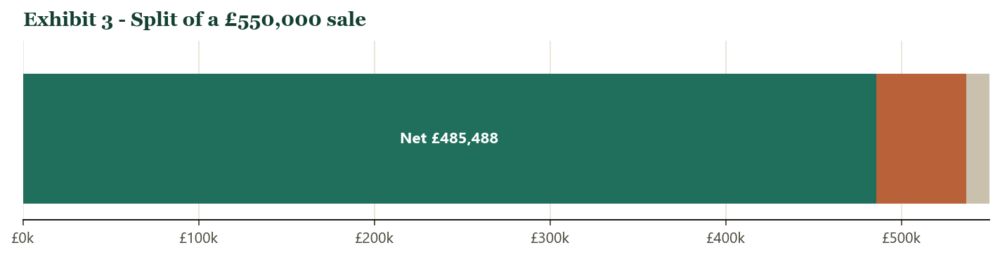

# Market Appraisal - 58, CRONIN STREET, LONDON, SE15 6JH

**Prepared by Riccardo Minniti** · 5 June 2026

**[Explore the interactive chart](58_interactive.html)**  ·  **[Value any property yourself on Telegram](https://t.me/usehonestly_bot)**

Send an address, pick vendor, buyer or agent, and get this same evidence-backed appraisal in seconds. The interactive chart lets you hover every sold comparable and open its HM Land Registry record.

---

## Contents

1. [Executive summary](#executive-summary)
2. [The property](#the-property)
3. [Comparable evidence](#comparable-evidence)
4. [Valuation](#valuation)
5. [Market conditions](#market-conditions)
6. [Live market & competitive positioning](#live-market-competitive-positioning)
7. [Recommended guide price](#recommended-guide-price)
8. [Net proceeds](#net-proceeds)
9. [Limitations](#limitations)
10. [Sources & references](#sources-references)

---

## Executive summary

A 4-bedroom, 1-bathroom maisonette of approximately 103 sqm, refurbished to a high standard. Comparable same-size, same-character properties define a price tier of £445,000 - £706,700.

| | |
|---|---|
| **Assessed value range** | **£550,000 - £600,000** (central ~£550,000) |
| **Recommended guide price** | **Offers Over £500,000** |
| **Last recorded sale** | £320,000 (6 Feb 2015) |
| **Held as** | Investment property - CGT applies |

## The property

Recorded internal area 1109 sqft (103 sqm); EPC C; Council Tax Band B; construction England and Wales: 1976-1982. Tenure: 125 years from 1 September 2003. Last sold £320,000 on 6 Feb 2015.

## Comparable evidence

Flats/houses of comparable size and character, within range, sold within 24 months to 5 June 2026, from HM Land Registry Price Paid Data, held live on PropertyData. Each linked transaction below opens the free record for that exact sale, with the property and its photographs.

### Tier A - comparable character

| Comparable · size | Sold | Price | £/sqm | Dist. | Source |
|---|---|---|---|---|---|
| Flat 8, 86, Chandler Way, SE15 6GT · 97 sqm | 2026-01 | £445,000 | £4,588 | 0.17 mi | [PropertyData](https://propertydata.co.uk/transaction/4C1B673F-A885-D8EA-E063-4704A8C0BF7D) |
| Flat 8, 105, Peckham Road, SE15 5LE · 92 sqm | 2026-03 | £500,000 | £5,435 | 0.27 mi | [PropertyData](https://propertydata.co.uk/transaction/50D10B84-743A-B8D0-E063-4704A8C08D98) |
| Flat 6, 73, Blakes Road, SE15 6HB · 95 sqm | 2024-06 | £505,000 | £5,316 | 0.2 mi | [PropertyData](https://propertydata.co.uk/transaction/2859C1AC-8F78-52B4-E063-4804A8C05948) |
| 95, Apartment 7, Peckham Road, SE15 5FA · 104 sqm | 2026-04 | £590,000 | £5,673 | 0.25 mi | [PropertyData](https://propertydata.co.uk/transaction/50D10B84-76DA-B8D0-E063-4704A8C08D98) |
| Flat 9, Hamley Lodge, 29, Peckham High Street, SE15 5EB · 118 sqm | 2024-10 | £612,500 | £5,191 | 0.35 mi | [PropertyData](https://propertydata.co.uk/transaction/44F406B6-EDBD-1095-E063-4704A8C048D4) |
| 102, Leontine Close, SE15 1UJ · 114 sqm | 2024-11 | £706,700 | £6,199 | 0.4 mi | [PropertyData](https://propertydata.co.uk/transaction/2ACACE8D-4ACB-295E-E063-4804A8C0B0EB) |

Tier A median **£547,500**.

### Tier B - distinct market tier (context only)

| Comparable · size | Sold | Price | £/sqm | Dist. | Source |
|---|---|---|---|---|---|
| Flat A, 65, Denman Road, SE15 5NS · 100 sqm | 2025-09 | £750,000 | £7,500 | 0.41 mi | [PropertyData](https://propertydata.co.uk/transaction/402A3A66-4D55-A7DF-E063-4804A8C0B80D) |
| Flat 3, 56, Denman Road, SE15 5NR · 93 sqm | 2026-03 | £765,000 | £8,226 | 0.44 mi | [PropertyData](https://propertydata.co.uk/transaction/4E75C29D-C0CD-8922-E063-4804A8C094D0) |

Higher-value tier; retained to mark the local ceiling, not used to value.

## Valuation

| Basis | Value |
|---|---|
| Tier A comparable median | £547,500 |
| Condition-adjusted valuation - average finish | £500,000 |
| Condition-adjusted valuation - high finish | £550,000 |
| Condition-adjusted valuation - very high finish | £600,000 |
| £/sqm cross-check (£5,375.5 × 103 sqm) | £553,676 |

Comparable evidence and the condition-adjusted valuation give an assessed range of **£550,000 - £600,000, central ~£550,000.** Confidence is moderate; see Limitations.

## Market conditions

| Indicator | Value |
|---|---|
| total_for_sale | 453 |
| months_of_inventory | 11.1 |
| days_on_market | 338 |
| demand_rating | Balanced market |

## Live market & competitive positioning

Sold prices establish what the property is *worth*; the live market shows what it is *competing against*. The assessed range above rests on completed sales - the only firm evidence of value. The asking prices below signal vendor expectation, not achieved value, and are **not** used in the assessment; they position the recommended guide against the homes a buyer can view today.

The live competitive band - flats currently listed across the district at £450,000 - £775,000, the realistic field for a property of this size and character. Bedroom count alone does not define a comparable (see Basis of assessment): size, condition and location set the price.

| Asking | Beds | Days listed | Status | Location | Listing |
|---|---|---|---|---|---|
| £775,000 | 3 | 2 | Available | Ivydale Road, SE15 3 | [Zoopla](https://www.zoopla.co.uk/for-sale/details/73349814/) |
| £765,000 | 3 | 65 | Available | Talfourd Road, SE15 5 | [Rightmove](https://www.rightmove.co.uk/properties/174041360) |
| £750,000 | 3 | 165 | Available | Sternhall Lane, SE15 4 | [Rightmove](https://www.rightmove.co.uk/properties/170557346) |
| £749,000 | 3 | 351 | Available | Bermondsey Heights, SE15 1 | [Rightmove](https://www.rightmove.co.uk/properties/163611641) |
| £719,000 | 3 | 807 | Available | 227-255 Ilderton Road, SE15 1 | [OnTheMarket](https://www.onthemarket.com/details/14542890/) |
| £712,000 | 3 | 722 | Available | 227-255 Ilderton Road, SE15 1 | [OnTheMarket](https://www.onthemarket.com/details/14540846/) |
| £700,000 | 3 | 10 | Available | Cheltenham Road, SE15 3 | [Zoopla](https://www.zoopla.co.uk/for-sale/details/73216854/) |
| £699,000 | 3 | 2 | Available | Bermondsey Heights, SE15 1 | [Zoopla](https://www.zoopla.co.uk/for-sale/details/73185499/) |
| £675,000 | 3 | 41 | Available | South City Court, SE15 6 | [Rightmove](https://www.rightmove.co.uk/properties/174931520) |
| £674,995 | 3 | 490 | Available | Nunhead Green, SE15 3 | [OnTheMarket](https://www.onthemarket.com/details/16472698/) |
| £650,000 | 3 | 114 | Available | Bellenden Road, SE15 4 | [Rightmove](https://www.rightmove.co.uk/properties/172110866) |
| £625,000 | 3 | 26 | Available | Woods Road, SE15 2 | [Zoopla](https://www.zoopla.co.uk/for-sale/details/73136323/) |
| £575,000 | 3 | 26 | Under offer | Gautrey Road, SE15 2 | [Zoopla](https://www.zoopla.co.uk/for-sale/details/70133310/) |
| £550,000 | 3 | 65 | Available | Trafalgar Avenue, SE15 6 | [Rightmove](https://www.rightmove.co.uk/properties/174005042) |
| £550,000 | 3 | 39 | Available | Lausanne Road, SE15 2 | [Rightmove](https://www.rightmove.co.uk/properties/174994025) |
| £525,000 | 3 | 44 | Available | Carlton Grove, SE15 2 | [Rightmove](https://www.rightmove.co.uk/properties/174819227) |
| £500,000 | 3 | 26 | Available | Ilderton Road, SE15 1 | [Zoopla](https://www.zoopla.co.uk/for-sale/details/72984214/) |
| £475,000 | 3 | 98 | Available | Queens Road, SE15 2 | [Rightmove](https://www.rightmove.co.uk/properties/87678816) |
| £460,000 | 3 | 72 | Available | Mona Road, SE15 2 | [Rightmove](https://www.rightmove.co.uk/properties/173641688) |
| £450,000 | 3 | 26 | Available | Queens Road, SE15 2 | [Zoopla](https://www.zoopla.co.uk/for-sale/details/73105430/) |

Median asking **£662,500**; average time on the market **159 days**. Each listing links to the live portal page - asking price, photographs, time on the market and the marketing agent.

**The cost of overpricing.** 7 of the 20 listings have sat unsold for 90 days or more - the longest: 227-255 Ilderton Road, SE15 1 at £719,000, listed 807 days; 227-255 Ilderton Road, SE15 1 at £712,000, listed 722 days; Nunhead Green, SE15 3 at £674,995, listed 490 days. Keenly-priced, well-presented stock behaves differently: 3 went to market within the last three weeks, and the only property under offer in the band was priced at £575,000. In this district an over-ambitious asking price does not win a higher sale - it produces a longer, costlier one.

**Where this property sits.** The recommended **Offers Over £500,000** is set at the lower end of the live band and **£162,500 below its median asking price** - deliberately. Anchored to sold evidence, it positions the property among the most competitively priced homes of its size and character on the market, to draw multiple viewings and competing offers toward the assessed **£535,000 - £600,000** target - rather than joining the stalled listings above.

## Recommended guide price

**Offers Over £500,000**, below the assessed range, to invite competing offers toward £535,000 - £600,000.

## Net proceeds

| Achieved price | Fee (2%+VAT) | Net of fee | Indicative CGT | Net of fee & CGT |
|---|---|---|---|---|
| £550,000 | £13,200 | £536,800 | £51,312 | £485,488 |
| £550,000 | £13,200 | £536,800 | £51,312 | £485,488 |
| £600,000 | £14,400 | £585,600 | £63,024 | £522,576 |

Indicative CGT at 24% higher-rate residential after the £3,000 annual exempt amount (2025/26); excludes acquisition and refurbishment costs (allowable). Not tax advice.

## Limitations

1. Floor area is EPC-recorded; a measured survey may differ.
2. Refurbishment specification not independently inspected.
3. Tier assignment is a draft for agent confirmation.
4. Asking prices are not used in the assessed value.

## Sources & references

[1] HM Land Registry Price Paid Data (OGL v3.0): https://www.gov.uk/search-house-prices. Via PropertyData API.

[2] PropertyData. [3] EPC Register. [4] HMRC CGT rates: https://www.gov.uk/capital-gains-tax/rates.

**Comparable records** (HM Land Registry Price Paid; each link opens the free PropertyData transaction record - exact sale, property detail and photographs):

- Flat 8, 86, Chandler Way, SE15 6GT - £445,000, 2026-01-30; ref. 4C1B673F-A885-D8EA-E063-4704A8C0BF7D. https://propertydata.co.uk/transaction/4C1B673F-A885-D8EA-E063-4704A8C0BF7D
- Flat 8, 105, Peckham Road, SE15 5LE - £500,000, 2026-03-17; ref. 50D10B84-743A-B8D0-E063-4704A8C08D98. https://propertydata.co.uk/transaction/50D10B84-743A-B8D0-E063-4704A8C08D98
- Flat 6, 73, Blakes Road, SE15 6HB - £505,000, 2024-06-21; ref. 2859C1AC-8F78-52B4-E063-4804A8C05948. https://propertydata.co.uk/transaction/2859C1AC-8F78-52B4-E063-4804A8C05948
- 95, Apartment 7, Peckham Road, SE15 5FA - £590,000, 2026-04-17; ref. 50D10B84-76DA-B8D0-E063-4704A8C08D98. https://propertydata.co.uk/transaction/50D10B84-76DA-B8D0-E063-4704A8C08D98
- Flat 9, Hamley Lodge, 29, Peckham High Street, SE15 5EB - £612,500, 2024-10-11; ref. 44F406B6-EDBD-1095-E063-4704A8C048D4. https://propertydata.co.uk/transaction/44F406B6-EDBD-1095-E063-4704A8C048D4
- 102, Leontine Close, SE15 1UJ - £706,700, 2024-11-26; ref. 2ACACE8D-4ACB-295E-E063-4804A8C0B0EB. https://propertydata.co.uk/transaction/2ACACE8D-4ACB-295E-E063-4804A8C0B0EB
- Flat A, 65, Denman Road, SE15 5NS - £750,000, 2025-09-05; ref. 402A3A66-4D55-A7DF-E063-4804A8C0B80D. https://propertydata.co.uk/transaction/402A3A66-4D55-A7DF-E063-4804A8C0B80D
- Flat 3, 56, Denman Road, SE15 5NR - £765,000, 2026-03-18; ref. 4E75C29D-C0CD-8922-E063-4804A8C094D0. https://propertydata.co.uk/transaction/4E75C29D-C0CD-8922-E063-4804A8C094D0

*Prepared by Riccardo Minniti, 5 June 2026. A comparative market appraisal based on HM Land Registry and PropertyData evidence; not a RICS Red Book valuation. CGT figures indicative, not tax advice.*

---

[Interactive chart](58_interactive.html)  ·  [Value any property on Telegram](https://t.me/usehonestly_bot)

*made with [Honestly](https://t.me/usehonestly_bot)*